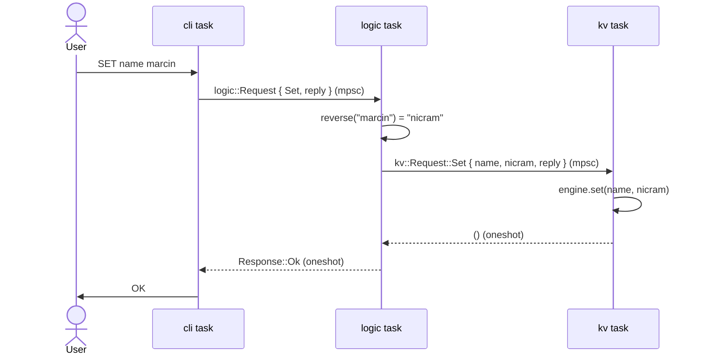

# Architecture

```text
               mpsc<logic::Request>                   mpsc<kv::Request>
stdin  +-----------+ -----------------> +-------------+ ----------------> +--------------+
-----> | cli task  |                    | logic task  |                   |   kv task    |
<----- | protocol  | <----------------- | reverse()   | <---------------- | owns HashMap |
stdout +-----------+ oneshot<Response>  +-------------+  oneshot<reply>   +--------------+
```

## Tasks

Three tokio tasks form a pipeline; dependencies go one way, `cli -> logic -> kv`. `app.rs`
creates the channels and spawns `kv` and `logic`; `main.rs` runs `cli` on stdin/stdout and
awaits all three.

- **cli** (`cli.rs`, `cli/protocol.rs`) reads lines, parses them into a `Command`, and writes
  the answer back as text. It is the only place that knows the text format (`OK`,
  `NOT_FOUND`, `ERR <reason>`, the `> ` prompt).
- **logic** (`logic.rs`) owns the domain: `Command`, `Response`, and the rule that SET and
  UPDATE store the value reversed. It turns each command into one storage request. It knows
  nothing about text or how the data is stored.
- **kv** (`kv.rs`) is the only owner of the data. It applies each request to a synchronous
  engine (`kv/engine.rs`), which holds the semantics of every operation. It knows nothing
  about commands, reversal or text.

## Communication

Each task is an actor: a loop that receives a request, handles it and replies. Requests go
over **bounded `mpsc`** channels: many producers and one consumer is exactly an actor's
inbox. The bound gives backpressure, so a fast producer waits instead of growing the queue
without limit. Each reply goes over a **`oneshot`** created for that request: the caller
keeps the receiver and sends the sender inside the request. That gives exactly one typed
answer per request with no request ids to match, and a dropped sender tells the caller the
task is gone.

`logic::Handle` and `kv::Handle` are typed clients: thin `Clone` wrappers around the
`mpsc::Sender` that build the request, send it and await the `oneshot`. All communication
still goes over the channels; cloning a handle adds a producer.



## State

All data lives in one `HashMap<String, String>` inside the kv task's engine. Nothing else
holds a reference to it: no `Arc`, no `Mutex`. Other tasks reach it only by sending requests.

## Concurrency

The tasks run concurrently on tokio's multi-threaded runtime, but each one handles its
messages one at a time. So kv applies operations one after another and each is atomic
without a lock. UPDATE is a single message that the engine checks and applies in one step,
never a GET plus a SET from outside, so a DELETE cannot land in between. Any number of
producers can share the store by cloning `logic::Handle`. Each producer awaits its reply
before it sends the next command, so it always reads its own writes.

Logic waits for the kv reply before it takes the next command. That keeps the order obvious,
but under many producers logic is the first bottleneck. The fix is pipelining: keep sending
to kv in order, and let a small task per request await the reply and answer the caller.

## Errors and shutdown

Bad input is answered with `ERR <reason>` and the session continues; `NOT_FOUND` is a normal
response. Failures depend on direction. A receiver returning `None` means the caller above
hung up, which is normal shutdown. A failed send to the task below means a dependency is
dead, so the task ends with that error rather than answering `ERR` forever. `main` awaits
every task and reports the deepest failure as the root cause, with a non-zero exit code.

Shutdown is a cascade: EOF or `EXIT` ends cli, which drops its handle, so logic's receiver
returns `None`, logic ends and drops its kv handle, and kv ends the same way.

## Testing

Each level is tested where its rules live. Unit tests pin the engine's semantics as plain
code, the protocol's parsing and exact output strings, and logic's reversal and the storage
request each command sends, against a fake kv that the test answers by hand. End-to-end
sessions run the real wiring, including the task's example byte for byte. Separate tests pin
task lifetime (cascade shutdown, a dead kv task, a caller that gives up) and concurrency
(many producers, UPDATE racing DELETE), because those are the failure modes an actor
pipeline adds.

## Trade-offs

- **Rejected:** `Arc<Mutex<HashMap>>` (shared state; atomic UPDATE would rely on every caller
  locking correctly), unbounded channels (no backpressure), a reply `mpsc` (needs request
  ids), `broadcast`/`watch` (fan-out and latest-value, not request and response).
- **Limitations:** sequential logic, data in memory only, DELETE leaves no tombstone.
- **Extensions:** pipelining in logic, Ctrl-C via a `CancellationToken`, and toward
  replication: per-folder actors, tombstones for DELETE, version vectors to detect conflicts.
